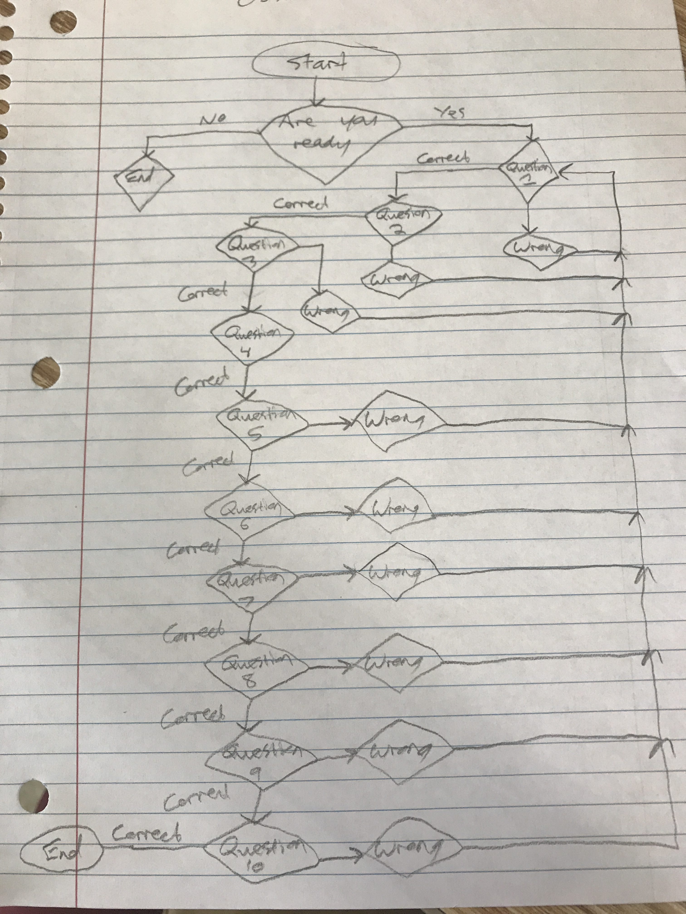
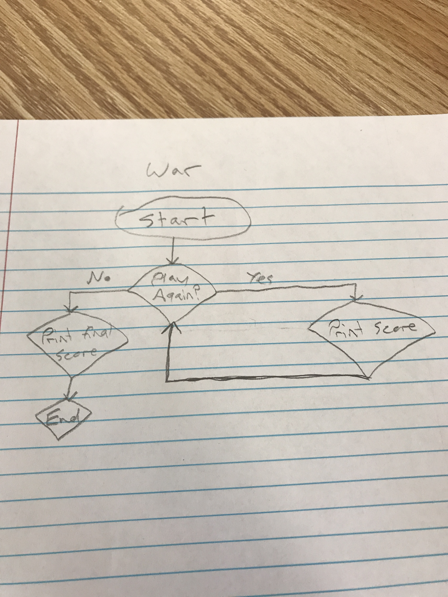
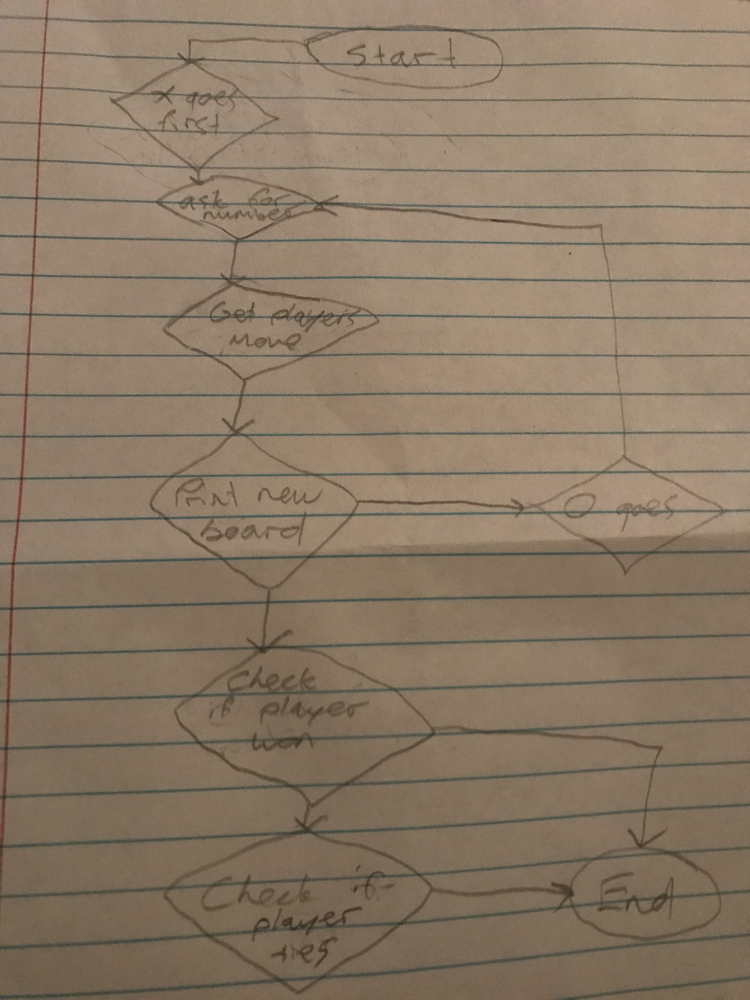

# ThaiCurtisFinalProject
  What we created was 3 games that you could choose from. One was ObstacleCourse, another was War, and the last one was TicTacToe. We created these because we wanted to give options to choose from instead of just one game. War is the card game where the cards are divided up evenly and each player gets 26 cards. The player with the highest cards takes the cards. ObstacleCourse is a set of 10 questions to get through, and if you get one wrong, you would need to start over to the first question. TicTacToe is a game with X's and O's with a board, if someones gets three X's or O's in a row, they win. If not, then it's a tie. An obstacle was that we would add up the scores for War, but the score would get deleted because we ran the program instead of the method. Another obstacle was not being able to come up with questions. One last obstacle was figuring out how to make a board in TicTacToe using an array. We both weren't too good with for loops, but using it would make it easier so we had to do it. YouTube videos and online tutorials helped us with making the board using an array. One thing we enjoyed was the satisfication of completing the programs.
<h3>Obstacle Couse Flow Chart</h3>

<h3>War Flow Chart</h3>

<h3>Tic-Tac-Toe Flow Chart</h3>

<a href ="https://youtu.be/76pwxd8l6Y4">My video is here</a>
